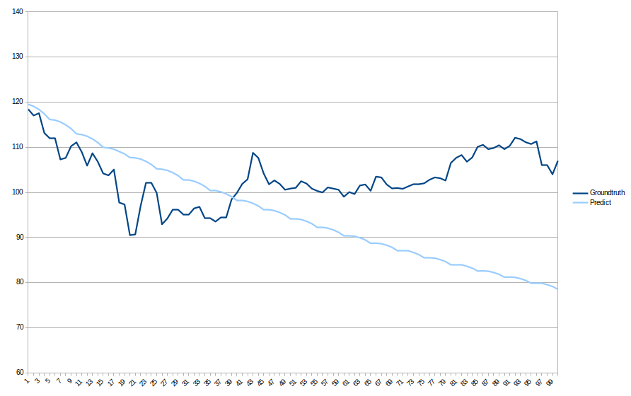

# MÔ TẢ ĐẦY ĐỦ PIPELINE DỰ BÁO GIÁ FPT 100 NGÀY BẰNG ROLLING ELASTIC NET

Toàn bộ pipeline gồm 6 khối chính:

1. **Tiền xử lý dữ liệu gốc**
2. **Xây dựng hệ thống đặc trưng (feature engineering)**
3. **Chuẩn hóa dữ liệu và tách tập validation**
4. **Rolling ElasticNet Forecasting**
5. **Đánh giá mô hình (return space và price space)**
6. **Huấn luyện mô hình cuối cùng và tạo submission**

Bản mô tả bên dưới ghi rõ vai trò, dữ liệu đầu vào, dữ liệu đầu ra và logic xử lý của từng phần.

---

# 1. Tiền xử lý dữ liệu gốc

### 1.1. Tính log-return và log-volume change

Từ dữ liệu OHLCV gốc, ta xây dựng hai đại lượng cơ bản:

* **ret_1d**: log-return của giá đóng cửa giữa hai phiên liên tiếp
  $$
  \text{ret\_1d} = \log(\text{close}*t) - \log(\text{close}*{t-1})
  $$

* **vol_chg**: log thay đổi volume
  $$
  \text{vol\_chg} = \log(\text{volume}*t+1) - \log(\text{volume}*{t-1}+1)
  $$

Hai biến này là nền tảng để xây dựng hệ thống đặc trưng dựa trên động lượng giá và hoạt động khối lượng.

### 1.2. Winsorize (làm mượt outlier) bằng phân phối của tập train

Để tránh outlier mạnh làm méo mô hình, ta **clip giá trị ret_1d và vol_chg dựa trên phân phối dữ liệu trước ngày validation (val_start)**.

* Giá trị thấp hơn quantile `clip_lower_q` → thay bằng quantile đó
* Giá trị cao hơn quantile `clip_upper_q` → thay bằng quantile đó

Kết quả tạo ra hai biến:

* `ret_1d_clipped`
* `vol_chg_clipped`

Các biến này được dùng trực tiếp khi xây dựng feature.

---

# 2. Xây dựng đặc trưng (Feature Engineering)

Pipeline feature tổng hợp nhiều nhóm đặc trưng:

### 2.1. Đặc trưng log-return và volume

* Các **lag** của return: ret_1d_clipped lag 1, 2, 3, 5, 10, 20, 60, 120
* Các **lag** của volume change
* Các rolling statistic: mean, std, min, max của price và volume

### 2.2. Đặc trưng từ giá đóng cửa

* SMA 20, 60, 90, 120
* Roll STD 20, 60, 120
* Bollinger width
* ATR, trend indicator, drawdown 200 ngày

### 2.3. Đặc trưng thời gian (calendar features)

* Ngày trong tuần (one-hot)
* Tháng trong năm (sin, cos)
* Số phiên giao dịch kể từ đầu dataset

### 2.4. Target dự báo

Target cho mô hình là:

$$[
y_t = \text{ret\_1d\_clipped}_{t+1}
]$$

Tức là dự báo return của **ngày kế tiếp**.

---

# 3. Chuẩn hóa dữ liệu và tách validation

### 3.1. Chuẩn hóa (StandardScaler)

Scaler được fit **chỉ trên tập train** (trước val_start) để tránh leak dữ liệu tương lai.
Sau đó áp dụng cho toàn bộ X.

### 3.2. Tách validation theo ngày

Dựa trên `val_start`, ta tạo:

* `mask_train`: toàn bộ điểm trước ngày val_start
* `mask_val`: toàn bộ điểm từ ngày val_start trở đi

Validation là một **khối thời gian liên tục**, phản ánh đúng cấu trúc dự báo thực tế.

---

# 4. Rolling ElasticNet Forecasting

Đây là trái tim của pipeline.

## 4.1. Ý tưởng

Tại mỗi thời điểm t, mô hình ElasticNet được **train lại từ đầu** chỉ bằng dữ liệu trước thời điểm đó, sau đó dự báo cho điểm t.

Điều này mô phỏng đúng cách mô hình hoạt động trong thực tế khi phải dự báo online.

## 4.2. Hai loại cửa sổ (window)

### • Sliding window

Sử dụng **window_size quan sát gần nhất**:
$
(i - \text{window\_size}, i)
$

### • Expanding window

Sử dụng toàn bộ dữ liệu lịch sử từ đầu đến i.

Cả hai đều được grid-search để chọn cấu hình tối ưu.

## 4.3. Cơ chế rolling

Với mỗi i ≥ window_size:

1. Chọn cửa sổ train đúng loại
2. Kiểm tra nếu y_train không đủ phân tán (không đủ variance) thì bỏ qua
3. Fit một ElasticNet mới
4. Predict tại điểm X[i]
5. Lưu vào preds[i]

Kết quả là một chuỗi dự báo 1-step-ahead tương ứng với toàn bộ dataset.

---

# 5. Đánh giá mô hình

Đánh giá gồm hai lớp:

## 5.1. Đánh giá trên **return-space**

Trên tập validation, tính:

* MAE
* MSE

Nếu mô hình bị scale lệch, ta sẽ calibrate lại bằng tuyến tính:

$$
y_{true} = a + b \cdot y_{pred}
$$

Mục đích là đưa dự báo về đúng mức dao động của return thực.

## 5.2. Đánh giá trên **price-space**

Từ return đã calibrate:

1. Biến đổi thành giá dự đoán bằng tích lũy mũ:
   $$[
   \hat{P}_t = P_{t-1} \cdot e^{\hat{r}_t}
   ]$$

2. So sánh với giá thực: MAE, MSE trên price.

3. Ensemble: kết hợp với mô hình naïve (giá t bằng giá t–1).
   Điều này giúp ổn định dự báo trong các giai đoạn thị trường nhiễu.

---

# 6. Huấn luyện mô hình cuối cùng và tạo submission

## 6.1. Huấn luyện mô hình cuối cùng

Mô hình final ElasticNet sử dụng:

* Cấu hình `window_type` và `window_size` tốt nhất tìm được
* Tham số `alpha`, `l1_ratio` tối ưu từ grid search tầng 2
* Train **một lần cuối** trước điểm cuối dataset:

### Nếu sliding

Dùng đoạn dữ liệu cuối có độ dài window_size.

### Nếu expanding

Dùng toàn bộ dữ liệu lịch sử.

## 6.2. Forecast 100 ngày tiếp theo

Dự báo 100 bước như sau:

1. Dùng mô hình final predict return t+1
2. Update lại giá (compound)
3. Append dữ liệu giả lập vào dataframe
4. Rebuild feature cho điểm t+2
5. Tiếp tục predict đến 100 ngày

Kết quả thu được:

* return_forecast_100
* price_forecast_100

Đây là giá trị dùng để tạo submission.

---

#  PHẦN CUỐI: FORMAT CHO SUBMISSION

Dưới đây là cấu trúc chuẩn bạn có thể dùng để trình bày trong report, notebook hoặc README:

---

## 🔹 **Kết quả Submission**

### 1. File submission

Gồm 2 cột:

| Day | ForecastedClose |
| --- | --------------- |
| 1   |119.510487       |
| 2   |119.065006      |
| …   | …               |
| 100 |116.145399        |


### 2. Kết quả dự báo 100 ngày

Kết quả trên public leader board:
```python
MSE: 52.9284 
```

### 3. Visualization



---
